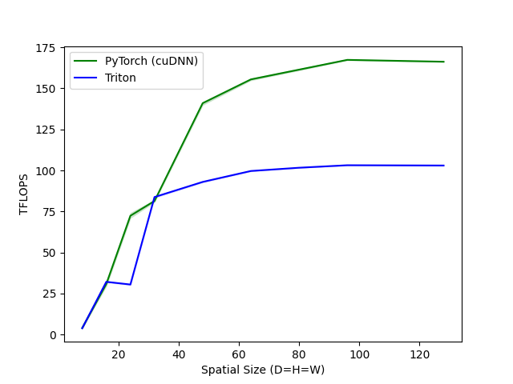
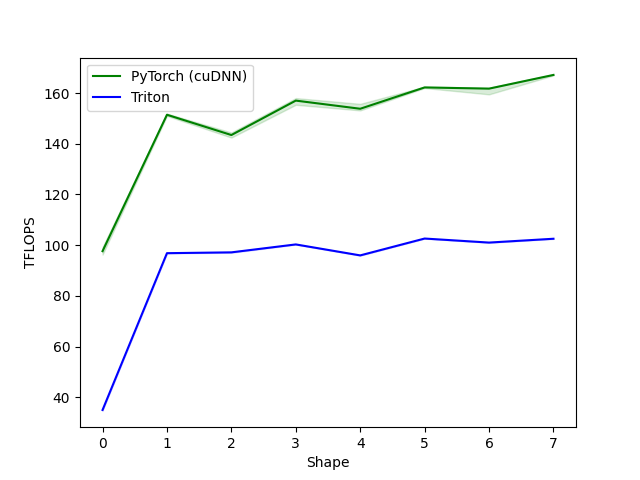

# Triton Conv3d — Implicit GEMM 实现与优化记录

## 概述

从零用 Triton 实现 3D 卷积 (Conv3d)，核心思路是 **Implicit GEMM**：
- 不物化 im2col 矩阵，通过索引计算隐式展开
- M = C_out, N = batch * D_out * H_out * W_out, K = C_in * kD * kH * kW

对标 PyTorch `torch.nn.functional.conv3d`（底层 cuDNN）。

## Benchmark 配置

- N=2, C_in=32, C_out=64, kernel=3x3x3, stride=1, padding=1
- 变量：spatial_size (D=H=W)，取 8~48
- dtype: FP16
- 硬件：PSC Bridges-2 GPU 节点

## 优化历程

### V0: 基础 Implicit GEMM

最直接的实现：
- 1D launch grid，行主序 `pid_m = pid // num_pid_n` 映射
- K 循环内每次迭代做 4 个整数除法解码 `rk -> (c_in, kd, kh, kw)`
- 5 个 mask AND 在一起（K边界 + N边界 + d/h/w 范围检查）
- weight 用原始 5D stride 寻址（4 个 stride 乘加）
- autotune 搜索 BLOCK_M/N/K

结果：spatial=32 时 ~28 TFLOPS，cuDNN ~83 TFLOPS（**33%**）

### V1: L2 Grouped Ordering (Swizzle)

**问题：行主序的 tile 调度浪费 L2 cache**

GEMM 视角下，每个 block 需要 A 矩阵（weight）的一行和 B 矩阵（input）的一列。
假设 `pid = pid_m * num_pid_n + pid_n`，相邻 pid 沿 N 方向走完一整行。

一个 wave 同时有 ~100 个 block 在跑时：
- 行主序：100 个 block 覆盖 1 行 M × 100 列 N → 共享 A 的 1 行（好），但要读 B 的 100 个不同列（差）→ 总共加载 **1 + 100 = 101 个 tile**
- Grouped ordering（GROUP_SIZE_M=10）：100 个 block 覆盖 10 行 × 10 列的正方形 → 共享 A 的 10 行和 B 的 10 列 → 总共加载 **10 + 10 = 20 个 tile**

同样 100 个 block，L2 需要 hold 的数据量少了 **5 倍**。

**实现**：把 program 按 GROUP_SIZE_M 行打包成 group，group 内部先沿 M 方向走完再换列。autotune 搜索 GROUP_SIZE_M in {1, 4, 8}。

**结果**：基本无提升（+0~3%）。原因：K 太小（864），整个 K 循环很快就结束，L2 里 hold 的数据总量远没到 L2 容量瓶颈（H100 L2 = 50MB），不会发生 cache eviction，所以减少 tile 数没有实际收益。瓶颈在 K 循环内的整数除法和 mask 开销。

### V2: 显式 Zero-Pad + Weight 2D Reshape (当前版本)

两个优化同时实施：

**A. 显式 Zero-Pad（消除 d/h/w mask）**
- wrapper 里用 `F.pad` 预先 pad 输入
- kernel 内删掉 `pad_d/h/w` 参数和 3 个空间范围检查
- input_mask 从 5 个 AND 降到 2 个

**B. Weight 2D Reshape（消除 4 个 weight stride）**
- `weight.view(C_out, -1)`，kernel 内 weight 地址 = `base + c * KDHW`
- 删掉 `weight_stride_ic/kd/kh/kw` 四个参数

结果：

| spatial | cuDNN | V0 | V2 | V0->V2 提升 | vs cuDNN |
|---------|-------|------|------|-------------|----------|
| 8 | 4.1 | 2.3 | 3.4 | 1.5x | 82% |
| 16 | 31.1 | 16.2 | 25.1 | 1.5x | 81% |
| 32 | 83.0 | 28.9 | 77.2 | **2.7x** | **93%** |
| 48 | 141.6 | 27.8 | 80.0 | **2.9x** | 56% |

spatial=32 时达到 cuDNN 的 **93%**。

### Benchmark 结果图

Realistic benchmark 中 X 轴 Shape 编号对应的具体配置：

| Shape | DxHxW | 场景 |
|-------|-------|------|
| 0 | 8x56x56 | 视频模型早期层 (I3D/SlowFast pool 后) |
| 1 | 16x112x112 | 视频模型 C3D 输入 |
| 2 | 32x64x64 | 医学影像 downsample 后 |
| 3 | 8x224x224 | 视频模型 SlowFast 输入 |
| 4 | 64x64x64 | 医学影像中间层 |
| 5 | 128x64x64 | 医学影像 (D 长) |
| 6 | 32x128x128 | 医学影像常见 |
| 7 | 64x128x128 | 医学影像大体数据 |

## 已知问题

### Saw-tooth 性能波动

spatial 非 2 的幂时性能大幅下降（32: 77 → 40: 38 → 48: 80 TFLOPS）。
原因：
1. `total_out` 非 2 的幂时，整数除法开销增大，L2 cache 对齐变差
2. 最后一个 N tile 被大量 mask 掉，做了无效计算

### cuDNN 在大 spatial 上差距拉大

cuDNN 对 k=3 stride=1 使用 Winograd 变换，实际只做 ~45% 的理论 FLOPs，但 benchmark 按理论 FLOPs 计算 TFLOPS，导致 cuDNN 数字被"虚高" ~2.25x。

spatial=32 时 cuDNN 报 83 TFLOPS（实际 ~37 TFLOPS），Triton 77 TFLOPS → Triton 真实吞吐其实是 cuDNN 的 ~2x。

### 寄存器压力限制 tile 放大

当前 kernel 预计算了完整的 `input_base_ptrs` (BLOCK_K x BLOCK_N) 并跨 c_in 循环存活，占用大量寄存器。BLOCK_N > 128 时会 spill 到 local memory。这限制了 arithmetic intensity 的进一步提升。

## 下一步优化方向

1. **降低寄存器压力**：不预计算完整指针数组，循环内即时计算地址（只做标量加法），使 BLOCK_N 可以放大到 256
2. **提高 arithmetic intensity**：放大 tile 到 128x256 / 256x128
3. **用 kernel=5 或 7 做 benchmark**：排除 Winograd 干扰，做更公平的对比
